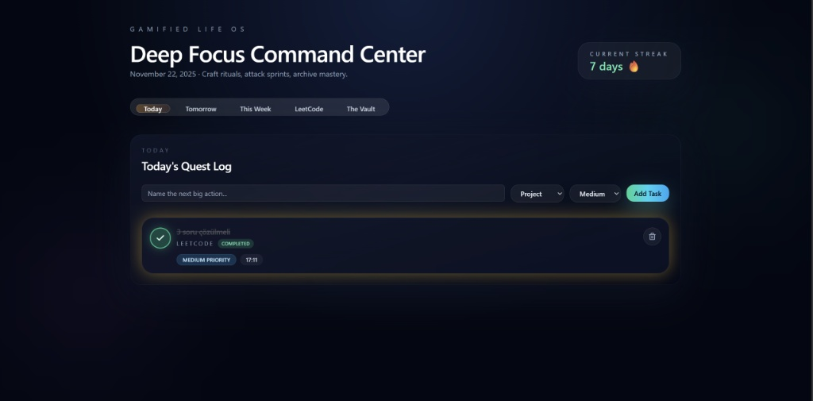

# Deep Focus OS

> **Gamify your growth. Track rituals. Archive mastery.**

A high-end, gamified life operating system built for developers and knowledge workers who want to transform productivity into a rewarding experience. Deep Focus OS combines task management, learning tracking, and visual analytics into a single, immersive command center.

---

## Features

### Quest System
Priority-based task management with category-driven visual coding:
- **Project** tasks with indigo/blue glow
- **LeetCode** challenges with amber/orange accents
- **Sport** activities with emerald/green highlights
- **Study** sessions with violet/purple themes

Features:
- Optimistic UI updates for instant feedback
- Smooth "pop" animations on task completion
- Real-time streak tracking (LeetCode-style)
- Smart sorting: incomplete tasks first, then by creation date

### The Vault
A digital sanctuary for your knowledge journey:
- **Library Section**: Track books with high-res covers, reading progress, and personal notes
- **Lab Section**: Log learning experiments and track mastery progress
- Bento-grid layout for visual organization
- Glassmorphism design with subtle gradients

### LeetCode Dojo
Visual analytics for coding practice:
- Radial progress charts showing solved problems vs. goals
- Topic-based progress tracking (Arrays, DP, Graphs, etc.)
- Real-time solved count updates
- Streak visualization

### Streak Engine
A logic-based activity tracker that rewards consistency:
- **One-per-day rule**: Streak increments only once per day, regardless of task count
- Automatic streak calculation and reset logic
- Visual feedback for daily achievements
- LeetCode-inspired streak mechanics

---

## Command Center

### Quest Log

*Daily Quest Log with Gamified Completion Logic*

### The Vault

*The Vault: Immersive Library & Knowledge Grid*

### LeetCode Dojo

*LeetCode Dojo: Visual Analytics for Coding Practice*

---

## Tech Stack

Deep Focus OS is built with modern, performant technologies:

- **Framework**: [Next.js 16](https://nextjs.org/) (App Router) with React 19
- **Language**: [TypeScript](https://www.typescriptlang.org/) for type safety
- **Styling**: [Tailwind CSS v4](https://tailwindcss.com/) with custom glassmorphism effects
- **Database**: [SQLite](https://www.sqlite.org/) with [Prisma ORM](https://www.prisma.io/) and [Drizzle ORM](https://orm.drizzle.team/)
- **Animations**: [Framer Motion](https://www.framer.com/motion/) for smooth, performant transitions
- **Charts**: [Recharts](https://recharts.org/) for beautiful data visualizations
- **UI Components**: [shadcn/ui](https://ui.shadcn.com/) for accessible, customizable components
- **Icons**: [Lucide React](https://lucide.dev/) for consistent iconography

---

## Getting Started

### Prerequisites

- Node.js 20.19+ (or 22.12+ / 24.0+)
- npm or yarn package manager

### Installation

1. **Clone the repository**
   ```bash
   git clone <repository-url>
   cd dashboard
   ```

2. **Install dependencies**
   ```bash
   npm install
   ```

3. **Set up the database**
   ```bash
   # Generate Prisma client
   npx prisma generate
   
   # Push schema to database
   npx prisma db push
   
   # (Optional) Sync Drizzle schema
   npx drizzle-kit push
   ```

4. **Seed initial data (optional)**
   ```bash
   npx tsx prisma/seed.ts
   ```

5. **Start the development server**
   ```bash
   npm run dev
   ```

6. **Open your browser**
   Navigate to [http://localhost:3000](http://localhost:3000)

### Environment Variables

Create a `.env` file in the `dashboard` directory (optional for SQLite):

```env
DATABASE_URL="file:./dev.db"
```

---

## Project Structure

```
dashboard/
├── src/
│   ├── app/
│   │   ├── actions/          # Server actions (todo, vault, leetcode)
│   │   ├── page.tsx          # Main dashboard page
│   │   └── layout.tsx        # Root layout
│   ├── components/
│   │   ├── dashboard/        # Feature components
│   │   │   ├── TaskCard.tsx
│   │   │   ├── TaskPanel.tsx
│   │   │   ├── TabVault.tsx
│   │   │   └── leetcode/
│   │   └── ui/               # shadcn/ui components
│   ├── db/
│   │   └── schema.ts         # Drizzle schema definitions
│   └── lib/
│       ├── prisma.ts         # Prisma client singleton
│       └── utils.ts          # Utility functions
├── prisma/
│   ├── schema.prisma         # Prisma schema
│   └── seed.ts               # Database seed script
└── public/                   # Static assets
```

---

## Design Philosophy

Deep Focus OS isn't just another todo app—it's a **Focus Environment** designed to minimize distraction and maximize flow state.

### Core Principles

1. **Dark Mode First**: Every pixel is optimized for extended use in low-light environments
2. **Visual Hierarchy**: Color-coded categories and priority levels create instant recognition
3. **Gamification**: Completion animations and streak tracking transform work into play
4. **Minimalist Aesthetics**: Glassmorphism and subtle gradients reduce visual noise
5. **Optimistic UI**: Instant feedback makes interactions feel responsive and rewarding

### The "Deep Focus" Experience

- **No Distractions**: Clean, purposeful interface that keeps you in the zone
- **Visual Rewards**: Satisfying animations celebrate your progress
- **Context Switching**: Seamless navigation between tasks, learning, and analytics
- **Ritual Building**: Streak mechanics encourage daily consistency

---

## Development

### Available Scripts

```bash
# Development
npm run dev          # Start Next.js dev server

# Production
npm run build        # Build for production
npm run start        # Start production server

# Database
npx prisma studio    # Open Prisma Studio (database GUI)
npx prisma generate  # Regenerate Prisma client
npx prisma db push   # Push schema changes to database

# Code Quality
npm run lint         # Run ESLint
```

### Database Management

The project uses both Prisma and Drizzle ORM:

- **Prisma**: Primary ORM for server actions and data access
- **Drizzle**: Schema definitions and migrations

To update the database schema:

1. Edit `prisma/schema.prisma` for Prisma models
2. Edit `src/db/schema.ts` for Drizzle tables
3. Run `npx prisma db push` to apply changes
4. Run `npx prisma generate` to regenerate the client

---

## Key Modules

### Quest System (`TaskPanel`, `TaskCard`)

- **Optimistic Updates**: UI updates instantly before server confirmation
- **Category-Based Styling**: Visual coding with emoji and glow effects
- **Priority Management**: Low, Medium, High priority with distinct badges
- **Completion Logic**: Tasks stay visible when completed (with strikethrough) for review

### The Vault (`TabVault`, `VaultBookCard`)

- **Book Tracking**: Cover images, progress bars, and note-taking
- **Experiment Logging**: Track learning projects and experiments
- **Bento Grid Layout**: Responsive, visually appealing organization
- **Modal Interactions**: Detailed views for each book/experiment

### LeetCode Dojo (`TabLeetCode`, `LeetCodeDojo`)

- **Radial Charts**: Visual progress indicators
- **Topic Cards**: Individual progress tracking per topic
- **Solved Count Updates**: Real-time problem tracking
- **Goal Setting**: Set and track coding goals

### Streak Engine (`updateDailyStreak`, `getStreakCount`)

- **One-Per-Day Logic**: Streak increments only once per day
- **Automatic Reset**: Detects missed days and resets appropriately
- **Activity Logging**: Tracks daily activity in `UserActivityLog` table
- **Visual Feedback**: Streak count displayed in UI

---

## Contributing

Contributions are welcome! Please feel free to submit a Pull Request.

1. Fork the repository
2. Create your feature branch (`git checkout -b feature/AmazingFeature`)
3. Commit your changes (`git commit -m 'Add some AmazingFeature'`)
4. Push to the branch (`git push origin feature/AmazingFeature`)
5. Open a Pull Request

---

## License

This project is licensed under the MIT License - see the LICENSE file for details.

---

## Acknowledgments

- Built with [Next.js](https://nextjs.org/) and the amazing React ecosystem
- UI components from [shadcn/ui](https://ui.shadcn.com/)
- Icons from [Lucide](https://lucide.dev/)
- Charts powered by [Recharts](https://recharts.org/)

---

## Roadmap

- [ ] Mobile responsive optimizations
- [ ] Dark/Light theme toggle
- [ ] Export/Import functionality
- [ ] Advanced analytics dashboard
- [ ] Integration with external APIs (GitHub, LeetCode API)
- [ ] Multi-user support
- [ ] Cloud sync capabilities

---

**Built with for developers who value focus, growth, and mastery.**
